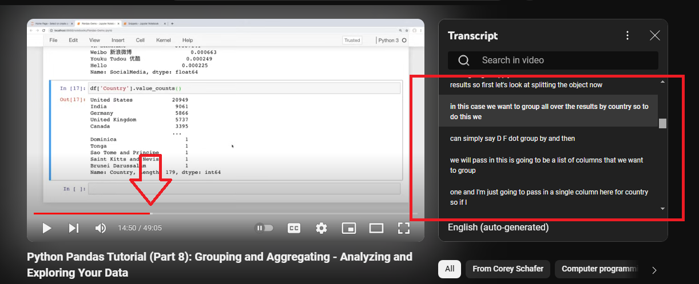
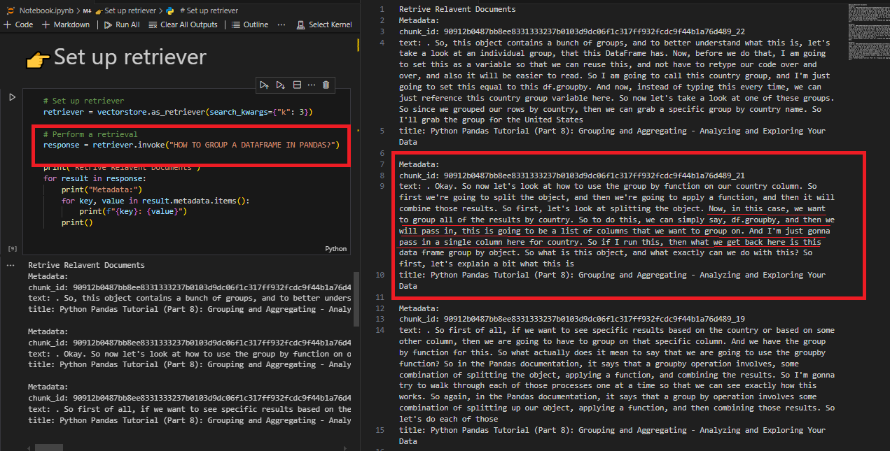

# Chunking Strategy for DataWars LLM Challenge

## Overview

This document outlines the strategy and implementation details for chunking video transcripts as part of the DataWars LLM Candidate Challenge. The goal is to preprocess video transcripts into manageable chunks that can be efficiently used by a Retrieval-Augmented Generation (RAG) model for answering user queries.

## Chunking Transcripts Strategy

- **Text Splitter**: We use `RecursiveCharacterTextSplitter` from LangChain to split the transcript text.
- **Parameters**:
  - `max_chunk_size`: The maximum length of each chunk. Set to 800 characters.
  - `overlap`: The number of overlapping characters between chunks. Set to 100 characters.
- **Separators**: Chunks are split at punctuation marks and new lines (`.`, `,`, `\n`, `\n\n`).

## Why this strategy works:
Chunk size and overlap: 1000 characters is a typical sweet spot for LLM models to process. It keeps chunks small enough to avoid exceeding token limits but large enough to retain context. The overlap helps ensure that even if a relevant part of the text spans two chunks, both chunks contain enough information to remain useful for retrieval.

### Why I Chose Length-Based and Sentence Boundary Chunking in Your Case:
**Simplicity and Efficiency:**

You want to build a retrieval-augmented generation (RAG) system that can answer questions. Using fixed chunk sizes is an efficient way to manage token costs and ensure each chunk fits into the LLM's token limits.
Sentence boundary chunking provides a nice balance of coherence and ease of implementation.

**Maximum/Minimum Chunk Size:**

I recommended a maximum chunk size of 800 because this strikes a good balance between providing enough context for retrieval while staying well within typical LLM token limits.
The overlap of 100 ensures some context is preserved between chunks, so sentences don’t get cut off between chunks, preserving meaning

## Metrics

### 2. Correctness
You can see in the screenshots when i ask the question "How can I group a DataFrames in Pandas?" it retrive the accurate chunks. At time 14:50 you can comparre with the actual video trancript.

## Conclusion
The chosen strategy of chunking by character length with overlap strikes a good balance between keeping the text easy to understand and making it efficient for the system to retrieve information. Using RecursiveCharacterTextSplitter, we can ensure that the chunks are clear and complete, with important parts of the text not being cut off. The overlap between chunks helps keep key information intact, making sure that the system can provide accurate and useful responses. This method keeps the chunks small enough for easy processing but large enough to include important details, making it a solid approach for the challenge.